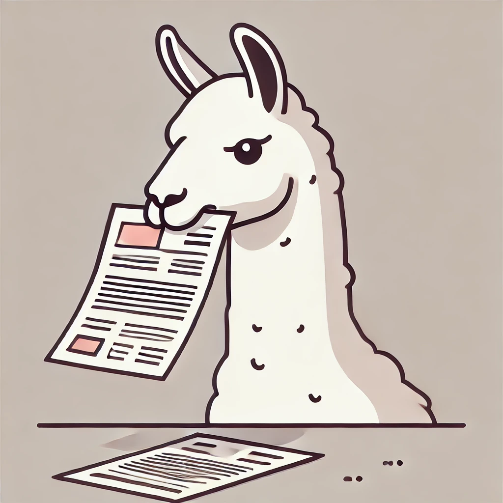
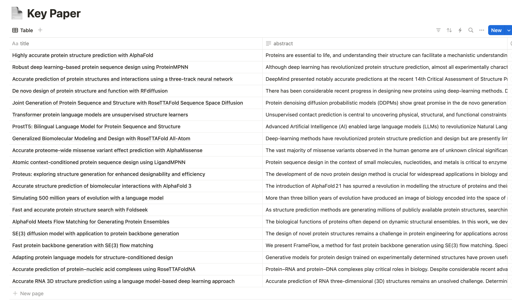
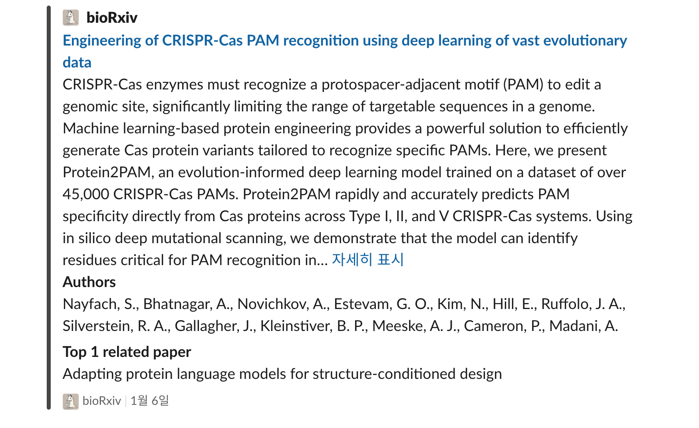

# Llama-Eat-Paper

**Llama-Eat-Paper**는 로컬 llm 프로그램인 [**Ollama**](https://ollama.com)를 활용하여, 사용자가 관심 있는 논문(key paper)과 유사한 논문을 찾아주는 Slack Bot입니다. 이 봇은 **Notion** database와 통합되어, 사용자가 관리하는 관심 논문들을 기반으로 논문 추천 서비스를 제공합니다. 또한, 논문 검색 기간을 설정하여 효율적으로 최신 논문을 팔로우 할 수 있습니다.

### 주요 기능
- 관심 논문 등록: 사용자는 관심 있는 논문을 **Notion** 데이터베이스에 등록하여 쉽게 관리할 수 있습니다.
- 논문 유사도 검색: 등록된 관심 논문을 기준으로 유사한 논문을 추천합니다.
- 검색 기간 설정: 논문 검색 기간을 설정할 수 있습니다. (기본 설정은 하루 전)
- Slack 통합: Slack 봇을 통해 쉽게 논문을 검색하고, 추천 결과를 Slack에서 바로 확인할 수 있습니다.

### 지원되는 논문 사이트
- BioRxiv
- Arxiv

## Preparation
### 1. Installation

    # 코드 다운로드
    git clone https://github.com/Buddha7771/Llama-Eat-Paper .
    cd Llama-Eat-Paper

    # 가상환경 설치
    conda create -n llama python=3.9
    conda activate llama

    # Ollama 설치
    pip install ollama
    ollama pull mxbai-embed-large

    # 패키지 설치
    pip install python-dotenv
    conda install chromadb numpy tqdm arxiv slack_sdk requests -c conda-forge

### 2. Create key paper list

1. **Notion** database를 생성하여 관심 논문의 "title"과 "abstract" 등록
2. 해당 페이지를 자신의 **Notion** Api와 연결
3. Dashboard id와 Api token를 `.env` 파일에 등록

### 3. 환경 변수 등록
`.env` 파일을 생성 후 아래와 같은 환경 변수를 등록합니다.

    SLACK_TOKEN = 'TOKEN'
    CHANNEL_ID = 'ID'
    NOTION_TOKEN = 'TOKEN'
    DATABASE_ID = 'ID'

## Usages

### Basic Usage:

    python run.py

위 스크립트는 하루 전에 올라온 논문을 조회하여 알림을 전송합니다.

### Optional Usage:

    python run.py --start_date 2025-01-04 --end_date 2025-01-08

위 스크립트는 2025년 1월 4일부터 2025년 1월 8일까지 올라온 논문을 조회하여 알림을 전송합니다.

## Setting up Daily Alerts

매일 자동으로 스크립트가 실행되도록 crontab에 등록합니다.

### 1. Edit your crontab:

    crontab -e

### 2. Add a new line for the daily notification:

    # crontab 파일에 다음줄을 입력
    0 09 * * * python /path/to/your/directory/run.py

이 cron job은 매일 아침 9시에 실행되어 등록한 Slack 채널로 아래와 같은 메세지를 전송합니다.

